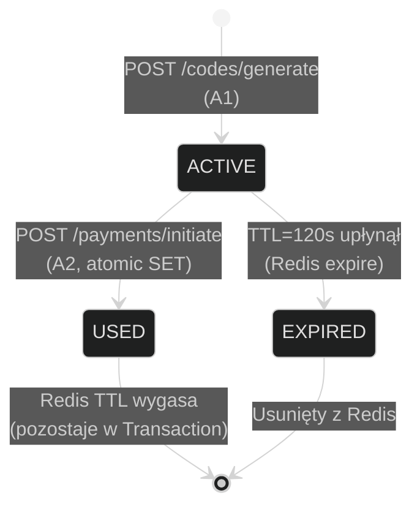
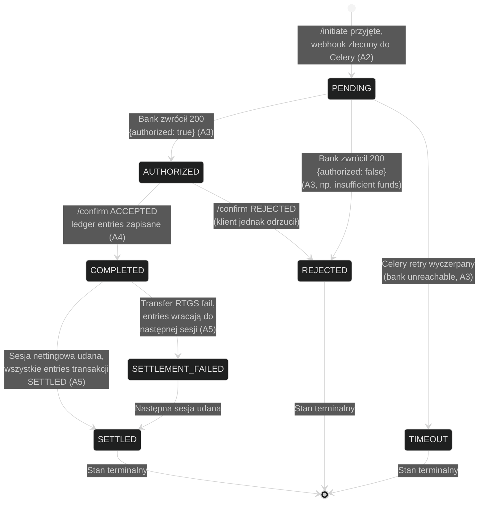
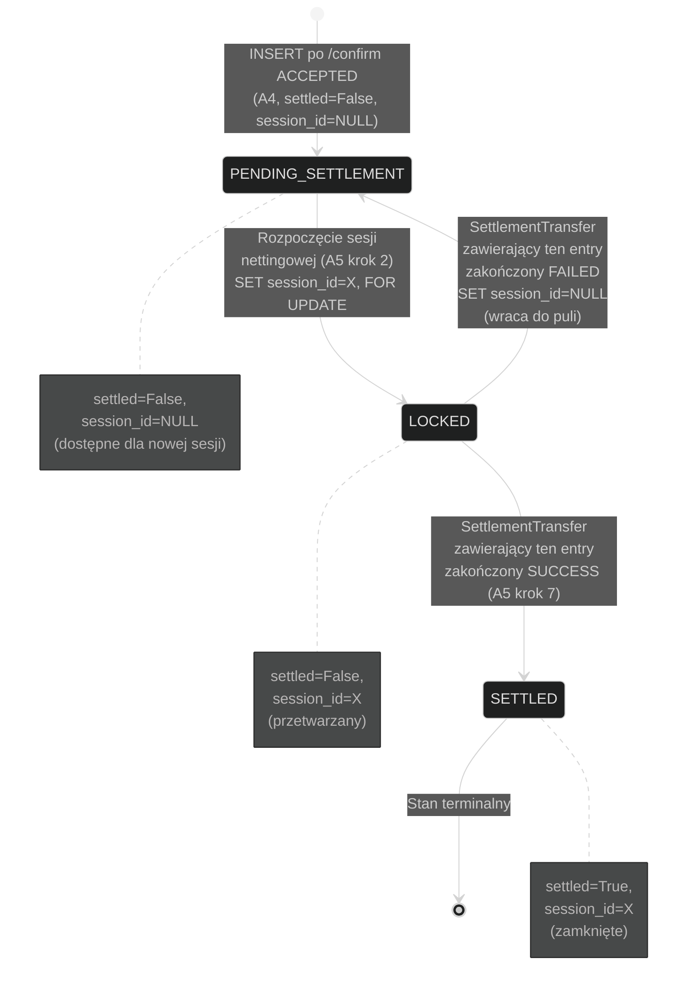
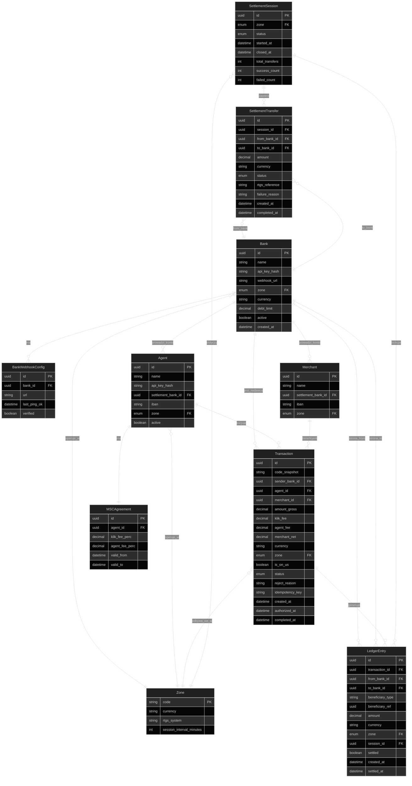
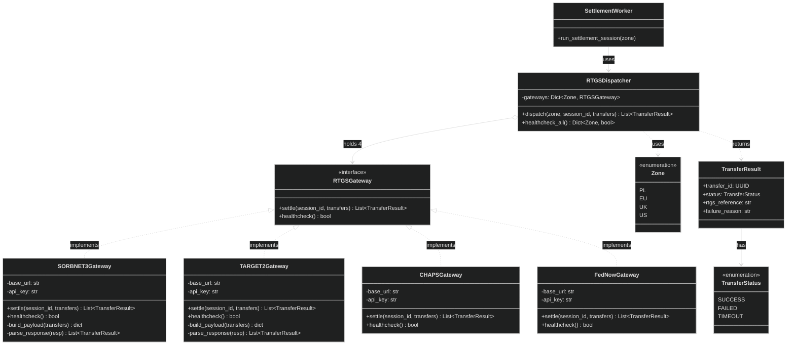

# Diagramy stanowe (B) i domenowe (C)

---

## B2 — Stany Transakcji (+ B1 stany Kodu jako podsekcja)

Cykl życia obiektów Transaction i Code.

**Code** (w Redis, krótki TTL):

**Transaction** (w Postgres, cache statusu w Redis):

**Uwagi do maszyny stanów Transaction:**

- `PENDING → REJECTED` i `PENDING → TIMEOUT` nie tworzą ledger entries (nic do rozliczenia).
- `AUTHORIZED → REJECTED` jest rzadki, ale możliwy: bank w webhooku zwrócił OK, ale przy `/confirm` już zwrócił REJECTED (np. user zmienił zdanie, bank znalazł AML flag).
- `SETTLEMENT_FAILED` nie jest naprawdę terminalny — entries wracają do puli i próbujemy ponownie w następnej sesji.
- Stany widoczne przez polling (`/payments/status`): PENDING, AUTHORIZED, COMPLETED, REJECTED, TIMEOUT. Stany SETTLED/SETTLEMENT_FAILED są po stronie clearingu i nie interesują agenta.

---

## B3 — Stany LedgerEntry

LedgerEntry to pojedyncze zobowiązanie wygenerowane z transakcji (jedna z kilku
pozycji w splicie: merchant_net, klik_fee, agent_fee). Żyje od `/confirm` do
zamknięcia sesji rozliczeniowej.

**Uwagi:**

- `LOCKED` to nie osobny enum, tylko widok logiczny: `settled=False AND session_id IS NOT NULL`.
- Bank zablokowany (`bank.active=False`) nie powoduje zmiany stanu entry — entry nadal `PENDING_SETTLEMENT`, ale query w A5 kroku 2 pomija go przez WHERE clause.
- Brak stanu terminalnego `FAILED` dla pojedynczego entry — fail jest zawsze na poziomie SettlementTransfer, a entry wraca do puli.

---

## C1 — ERD (model bazy danych)

Trzon modelu domenowego. Pomija tabele techniczne (django_migrations, auth_user,
sessions) i audit log.

**Uwagi do ERD:**

1. **`beneficiary_type` + `beneficiary_ref` w LedgerEntry** — beneficjentem może być bank (merchant_net, inter-bank), KLIK (klik_fee), lub Agent (agent_fee). Zamiast trzech osobnych FK używamy polimorficznej referencji: `beneficiary_type` enum (BANK / KLIK / AGENT), `beneficiary_ref` UUID. Samo pole `to_bank_id` wskazuje bank fizycznie otrzymujący środki przez RTGS (czyli bank w którym beneficjent ma konto — `settlement_bank_id` agenta/merchanta lub bank reprezentujący KLIK).

2. **KLIK jako "uczestnik"** — KLIK nie ma osobnej tabeli. Jest reprezentowany przez konstantę (np. singleton `KLIK_ACCOUNT` w kodzie) z polem `settlement_bank_id` w konfiguracji (`.env` per strefa). Analogicznie: w strefie PL KLIK ma konto w Banku X, w strefie UK w Banku Y itd.

3. **`Code` nie jest w ERD** — bo żyje tylko w Redisie i nie ma reprezentacji w Postgres. `Transaction.code_snapshot` przechowuje wartość kodu dla audytu.

4. **`Zone` jako tabela** — formalnie moglibyśmy to trzymać w `.env` jako enum, ale tabela daje operator'owi możliwość zmiany `session_interval_minutes` bez restartu (Django admin). Useful dla demo.

5. **Brakuje tu** — audit log (kto kiedy co zmienił w banku/agencie), tabela alertów dla operatora, tabela historii transakcji idempotency. Do dopisania jeśli będzie potrzebne, ale nie jest krytyczne dla rdzenia.

---

## C2 — Dispatcher RTGS (diagram klas / strategy pattern)

Architektura dispatcher'a: jedna abstrakcja, cztery implementacje, wybór po strefie.

**Mapowanie Zone → Gateway (w RTGSDispatcher):**

| Zone | Gateway | Waluta | URL (z `.env`) |
|---|---|---|---|
| PL | SORBNET3Gateway | PLN | `SORBNET3_URL` |
| EU | TARGET2Gateway | EUR | `TARGET2_URL` |
| UK | CHAPSGateway | GBP | `CHAPS_URL` |
| US | FedNowGateway | USD | `FEDNOW_URL` |
