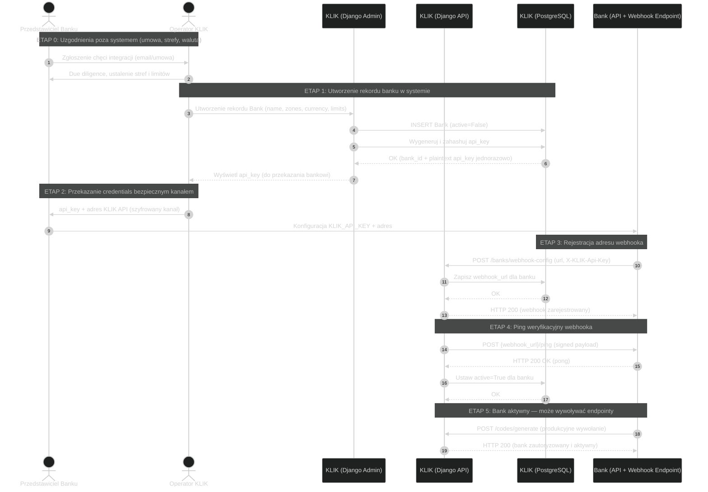
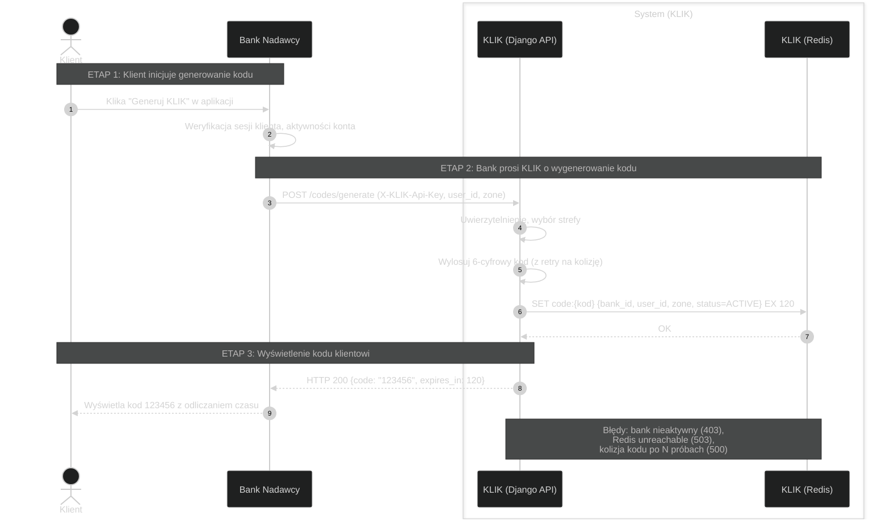
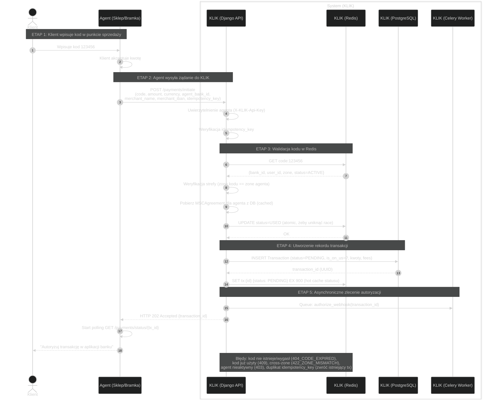
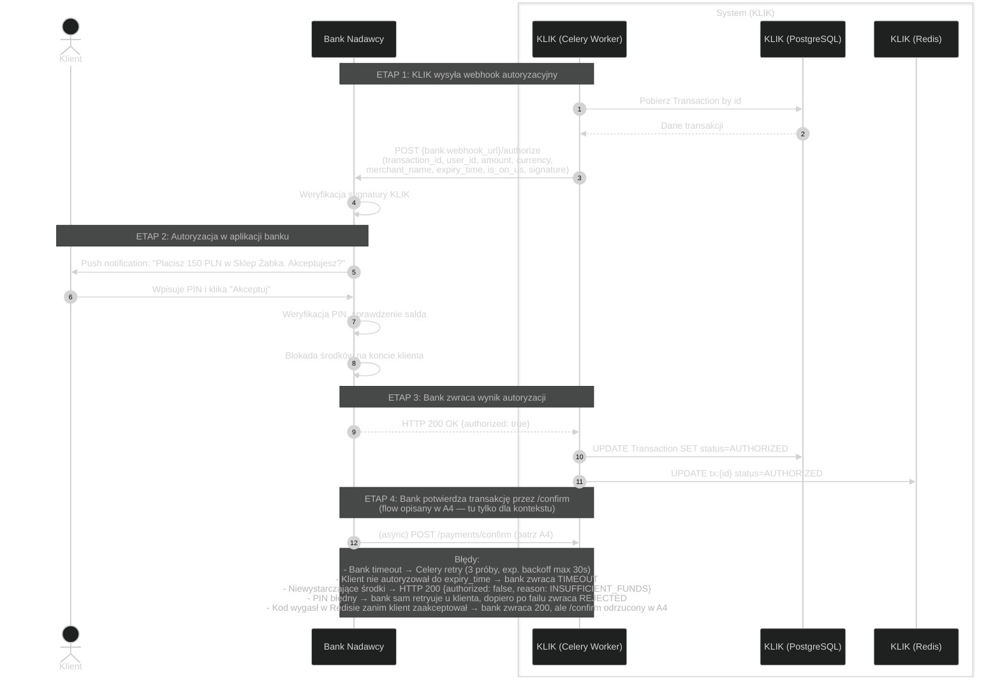
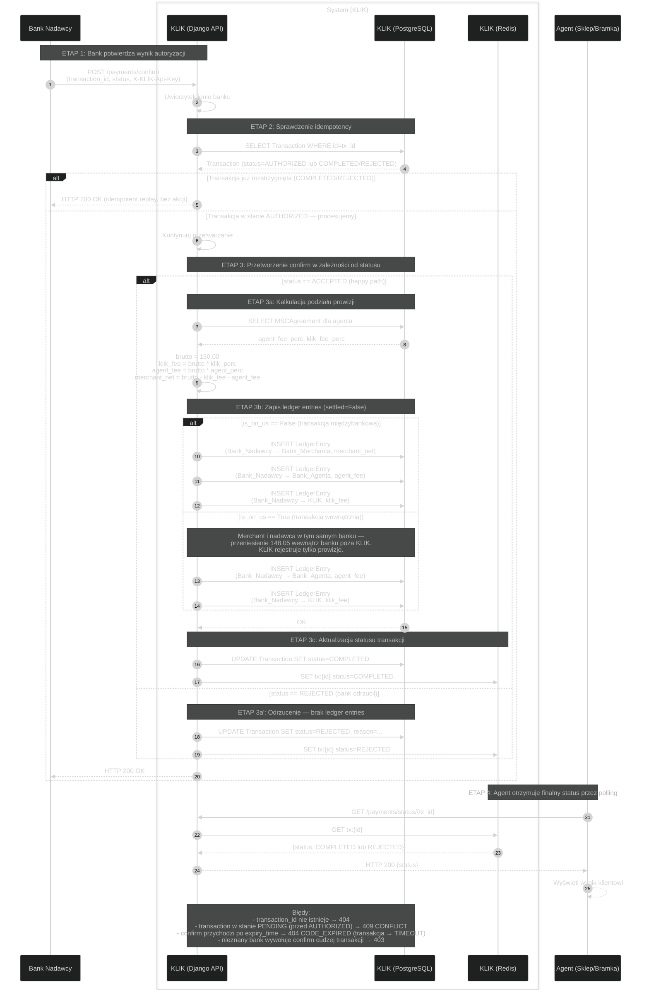
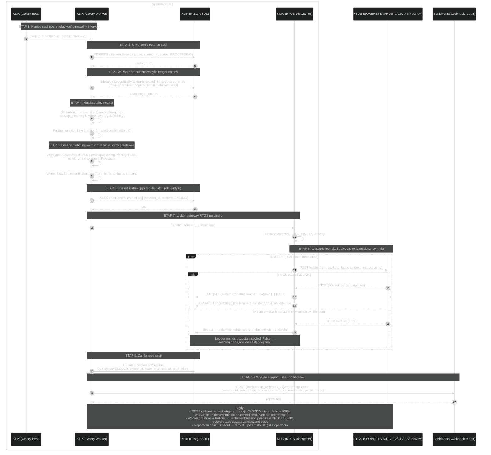

# Diagramy C2B — Etapy A0–A3

Diagramy sekwencji dla modułu płatności kodem (C2B) w systemie KLIK.

---

## A0 — Onboarding banku

Proces rejestracji nowego banku w ekosystemie KLIK. Zawiera kroki wykonywane
poza systemem (umowa, email) oraz techniczną weryfikację połączenia.



---

## A1 — Generowanie kodu

Klient prosi swój bank o wygenerowanie kodu KLIK. Bank prosi KLIK,
KLIK zapisuje kod w Redis z TTL=120s.



---

## A2 — Inicjacja transakcji przez agenta

Klient wpisuje kod w terminalu/sklepie. Agent wysyła kod do KLIK,
KLIK tworzy transakcję i zleca asynchroniczne wywołanie webhooka
do banku nadawcy.



---

## A3 — Autoryzacja przez bank nadawcy

Celery Worker uderza do webhooka banku nadawcy. Bank pokazuje klientowi
push z prośbą o autoryzację. Klient akceptuje PINem.



---

## Tabela kontekstowa: pola `is_on_us` i `zone`

| Pole | Typ | Kiedy ustawiane | Źródło prawdy |
|------|-----|-----------------|---------------|
| `is_on_us` | bool | Przy tworzeniu Transaction (A2 krok 4) | `bank_id` kodu == `agent_bank_id` |
| `zone` | enum (PL/UK/US/EU) | Przy generowaniu kodu (A1 krok 2) | Strefa banku nadawcy |
| Walidacja strefy | — | A2 krok 3 | `code.zone == agent.zone` lub 422_ZONE_MISMATCH |

---

## A4 — Confirm, kalkulacja splitu i zapis do ledgera

Bank nadawcy (po autoryzacji z A3) wywołuje `/payments/confirm`. KLIK
kalkuluje podział prowizji, zapisuje ledger entries w zależności od
`is_on_us`, i aktualizuje status transakcji.

Happy path (ACCEPTED) i rejected path (REJECTED) pokazane w jednym
diagramie przez blok `alt`.



---

## Tabela: Split prowizji — przykład liczbowy

| Pole | Wartość | Komentarz |
|------|---------|-----------|
| Kwota brutto (co płaci klient) | 150.00 PLN | Wpisane przez agenta w `/initiate` |
| `klik_fee_perc` | 0.3% | Z MSCAgreement (globalny lub per agent) |
| `agent_fee_perc` | 1.0% | Z MSCAgreement per agent |
| KLIK fee | 0.45 PLN | 150 * 0.003 |
| Agent fee | 1.50 PLN | 150 * 0.010 |
| Merchant netto | 148.05 PLN | 150 - 0.45 - 1.50 |

---

## Tabela: Ledger entries per scenariusz

**Założenia:** Brutto 150 PLN. KLIK fee 0.45, Agent fee 1.50, Merchant 148.05.

### Scenariusz OFF-US (Bank A nadawcy ≠ Bank B merchanta, Agent w Banku C)

| From | To | Amount | Cel |
|------|-----|--------|-----|
| Bank A | Bank B | 148.05 | Płatność do merchanta |
| Bank A | Bank C | 1.50 | Prowizja agenta |
| Bank A | KLIK | 0.45 | Prowizja KLIK |

### Scenariusz ON-US (Bank A nadawcy = Bank B merchanta, Agent w Banku C)

| From | To | Amount | Cel |
|------|-----|--------|-----|
| Bank A | Bank C | 1.50 | Prowizja agenta |
| Bank A | KLIK | 0.45 | Prowizja KLIK |

*(Przeniesienie 148.05 wewnątrz Banku A — poza KLIK, sprawa banku)*

---

## A5 — Sesja nettingowa i settlement przez RTGS

Celery Beat triggeruje koniec sesji per strefa. KLIK agreguje niesetlowane
ledger entries, robi multilateralny netting, dopasowuje dłużników do
wierzycieli (greedy matching), i wysyła instrukcje settlementu przez
odpowiedni RTGS gateway.

Częściowy commit: nieudane instrukcje lądują w kolejce do następnej sesji.



---

## Przykład: Multilateralny netting z greedy matching

**Setup:** Sesja PL, 4 uczestników: Bank A, Bank B, Bank C, KLIK.

**Ledger entries w sesji:**
```
Bank A → Bank B:   500 PLN (transakcja off-us)
Bank A → Bank C:    50 PLN (agent fee)
Bank A → KLIK:      15 PLN (klik fee)
Bank B → Bank A:   200 PLN (inna transakcja off-us w drugą stronę)
Bank B → KLIK:      10 PLN (klik fee)
Bank C → Bank A:   100 PLN (off-us, Bank C klient, Bank A merchant)
Bank C → KLIK:      5 PLN
```

**Krok 1 — Pozycje netto per uczestnik:**

| Uczestnik | Kredyty (otrzyma) | Debety (zapłaci) | Netto |
|-----------|-------------------|------------------|-------|
| Bank A | 200 + 100 = 300 | 500 + 50 + 15 = 565 | **-265** (dłużnik) |
| Bank B | 500 | 200 + 10 = 210 | **+290** (wierzyciel) |
| Bank C | 50 | 100 + 5 = 105 | **-55** (dłużnik) |
| KLIK | 15 + 10 + 5 = 30 | 0 | **+30** (wierzyciel) |

**Sanity check:** suma netto = 0 ✓

**Krok 2 — Greedy matching:**

Sortuj dłużników malejąco: [Bank A -265, Bank C -55]
Sortuj wierzycieli malejąco: [Bank B +290, KLIK +30]

- Bank A płaci Bank B min(265, 290) = 265 → Bank A: 0, Bank B: +25
- Bank C płaci Bank B min(55, 25) = 25 → Bank C: -30, Bank B: 0
- Bank C płaci KLIK min(30, 30) = 30 → Bank C: 0, KLIK: 0 ✓

**Rezultat — 3 przelewy RTGS zamiast 7 ledger entries:**

| From | To | Amount |
|------|-----|--------|
| Bank A | Bank B | 265 |
| Bank C | Bank B | 25 |
| Bank C | KLIK | 30 |

---
