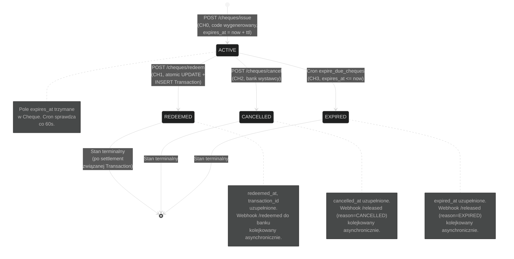
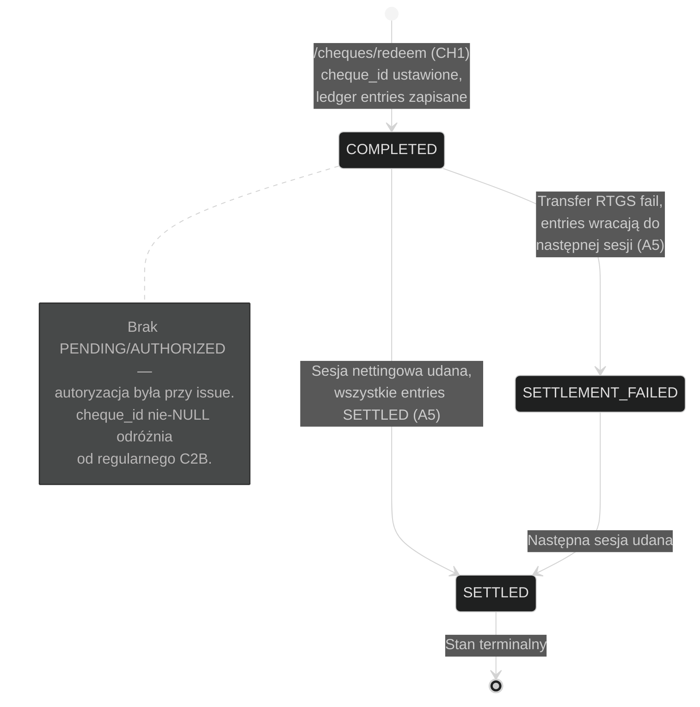
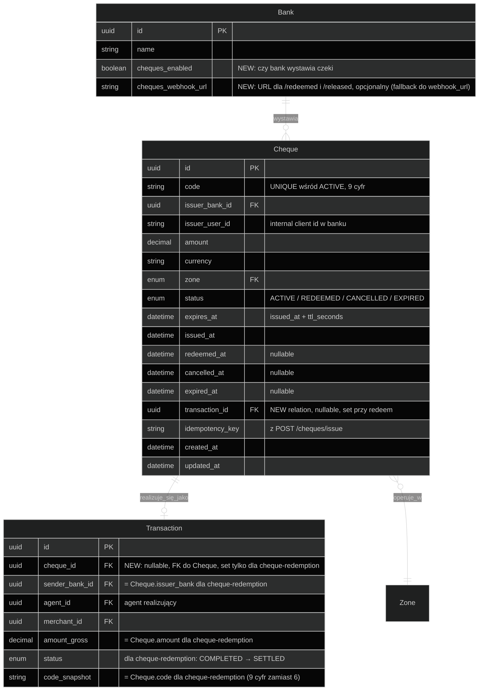

# KLIK Cheques — Diagramy stanów i domeny

Diagramy stanów obiektów modułu Cheques + zaktualizowany ERD systemu z nowymi
encjami.

## Spis treści

### Diagramy stanowe (B)
- [B-CH1 — Stany Cheque](#b-ch1--stany-cheque)
- [B-CH2 — Stany Transaction wygenerowanej z czeku](#b-ch2--stany-transaction-wygenerowanej-z-czeku)

### Diagramy domenowe (C)
- [C-CH1 — ERD update (Cheque w modelu)](#c-ch1--erd-update-cheque-w-modelu)

### Dokumenty referencyjne
- [Uwagi do modelu](#uwagi-do-modelu)
- [Wpływ na istniejące encje](#wpływ-na-istniejące-encje)

## Powiązana dokumentacja
- [WORKFLOW.md](./WORKFLOW.md) — diagramy sekwencji (CH0-CH4)
- [../integration/INFO.md](../integration/INFO.md) — API reference, słownik
- [../../c2b/diagrams/STATE.md](../../c2b/diagrams/STATE.md) — pełny ERD systemu (Bank, Agent, Transaction, LedgerEntry, ...)

---

## B-CH1 — Stany Cheque

Cheque żyje w Postgres przez maksymalnie `CHEQUE_TTL_MAX_SECONDS` (default 72h)
plus retencja audytowa (osobna kwestia, TBD). Cykl życia w trzech terminalnych
gałęziach: realizacja, anulacja, wygaśnięcie.



**Uwagi do maszyny stanów Cheque:**

- Brak przejścia między stanami terminalnymi (REDEEMED → CANCELLED nie istnieje). Po REDEEMED czek jest "zużyty" — anulować można tylko aktywny.
- Race między CH1 (redeem), CH2 (cancel), CH3 (expire) jest zarządzany przez `SELECT FOR UPDATE` na rekordzie Cheque. Pierwszy commit wygrywa, kolejni dostają stan post-zmiana i adekwatny błąd (`409_CHEQUE_NOT_ACTIVE`) lub no-op (cron expire).
- Stan ACTIVE jest jedynym non-terminalnym. Webhooki end-of-life mają osobny mechanizm retry (Celery) — *fakt* zmiany stanu jest niezależny od *dostarczenia* notyfikacji do banku.

---

## B-CH2 — Stany Transaction wygenerowanej z czeku

`Transaction` powstała z `/cheques/redeem` ma uproszczony cykl życia w porównaniu
do regularnej C2B Transaction — **pomija PENDING i AUTHORIZED**, bo autoryzacja
klienta odbyła się przy wystawieniu czeku.



**Uwagi:**

- Stany REJECTED/TIMEOUT z C2B Transaction nie występują dla cheque-redemption — w momencie redempcji wszystko już jest pewne (autoryzacja, hold, dane czeku). Jedyna ścieżka błędna w `/redeem` to walidacje zwracające 4xx **przed** utworzeniem Transaction.
- `Transaction.cheque_id` (FK) jest NULL dla regularnego C2B i nie-NULL dla cheque-redemption. Kod ledgera nie musi tego rozróżniać — split prowizji i entries są identyczne.

---

## C-CH1 — ERD update (Cheque w modelu)

Diagram pokazuje **tylko nowe i zmodyfikowane** encje. Pełny ERD bez zmian:
[../../c2b/diagrams/STATE.md, sekcja C1](../../c2b/diagrams/STATE.md#c1--erd-model-bazy-danych).



---

## Uwagi do modelu

### 1. Unikalność kodu

Constraint `UNIQUE (code, status=ACTIVE)` (partial unique index w Postgres):

```sql
CREATE UNIQUE INDEX cheque_active_code_unique
    ON cheques (code)
    WHERE status = 'ACTIVE';
```

Pozwala mieć w bazie ten sam kod w różnych stanach (np. czek `123456789`
EXPIRED z 2026-04-01 oraz nowy `123456789` ACTIVE z 2026-05-03). Stan ACTIVE
jest jedynym w którym kod musi być unikalny — kolizja z REDEEMED/CANCELLED/EXPIRED
nie jest problemem (kod jest historyczny, nie do realizacji).

### 2. Indeksy

Sugerowane indeksy dla wydajności (do potwierdzenia w PR z modelem):

- `(code, status)` — lookup z `/redeem` (gdzie status=ACTIVE)
- `(status, expires_at)` — cron `expire_due_cheques` (gdzie status=ACTIVE AND expires_at <= now)
- `(issuer_bank_id, status, created_at DESC)` — `/cheques/status` listing dla banku
- `(idempotency_key, issuer_bank_id)` — idempotency lookup dla `/issue`

### 3. Transaction.cheque_id jako nullable FK

Prosta opcja do polimorfizmu "skąd pochodzi transakcja". W przyszłości jeśli pojawią
się inne źródła Transaction (np. recurring) można dorobić kolejne nullable FK
albo refaktor do `source_type` enum + `source_ref` UUID (jak w `LedgerEntry.beneficiary_*`).
Dla MVP nullable FK wystarczy.

### 4. Audit i retencja

Cheques w stanach terminalnych (REDEEMED/CANCELLED/EXPIRED) są zachowane
w bazie dla:
- Audit trail (kto, kiedy, ile, czy zrealizowane)
- Rozstrzygania sporów (klient twierdzi że nie wystawiał czeku)
- Statystyk operatora KLIK

Polityka retencji: TBD jako osobne zadanie. Domyślnie nieusuwane.

### 5. Brak osobnego Cheque LedgerEntry type

Świadomie **nie wprowadzamy** `LedgerEntryType.CHEQUE_HOLD` ani podobnych:
hold po stronie banku jest niewidoczny dla KLIK ledgera. Po redempcji
LedgerEntries są typu `BANK_TO_BANK`, `KLIK_FEE_C2B`, `AGENT_FEE` — identyczne
jak dla regularnego C2B.

---

## Wpływ na istniejące encje

### Bank (modyfikacja)

Dodajemy 2 pola:

| Pole | Typ | Default | Opis |
|---|---|---|---|
| `cheques_enabled` | bool | `False` | Bank uczestniczy w module Cheques |
| `cheques_webhook_url` | URL | `''` | URL endpointów `/cheques/redeemed` i `/cheques/released`. Pusty = fallback do `Bank.webhook_url`. |

Migracja: dodanie pól nieboleśnie (oba mają default).

### Transaction (modyfikacja)

Dodajemy 1 pole:

| Pole | Typ | Default | Opis |
|---|---|---|---|
| `cheque_id` | FK Cheque | `NULL` | NULL dla regularnego C2B, set dla cheque-redemption |

Migracja: dodanie nullable FK — bez wpływu na istniejące rekordy.

### Brak zmian w innych encjach

`Agent`, `MSCAgreement`, `Merchant`, `LedgerEntry`, `SettlementSession`,
`SettlementTransfer`, `Alias` — bez zmian.

---

## Tabela porównawcza encji per moduł

| Encja | C2B | P2P | Cheques |
|---|---|---|---|
| **Centralny obiekt** | Code (Redis) | Alias (Postgres) | Cheque (Postgres) |
| **TTL** | 120s | brak | 1h–72h |
| **Tworzy Transaction** | tak (przez initiate+confirm) | nie | tak (przez redeem, od razu COMPLETED) |
| **Tworzy LedgerEntries** | przy /confirm ACCEPTED | przy P4 accrual | przy /redeem |
| **Webhooki banku** | `/authorize` (issue), brak (end) | brak | brak (issue), `/redeemed`+`/released` (end) |
| **Cron tasks** | brak własnych | P4 accrual (23:55 UTC) | CH3 expire (co 60s) |
