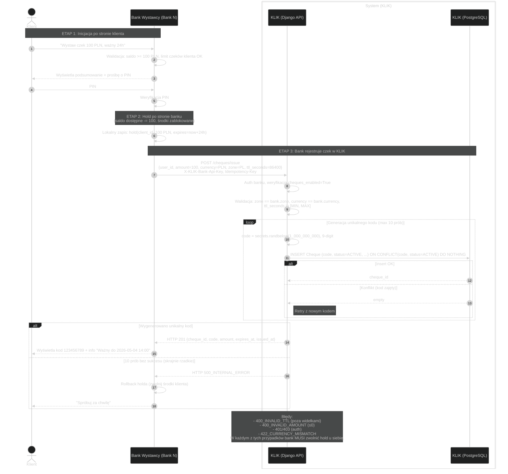
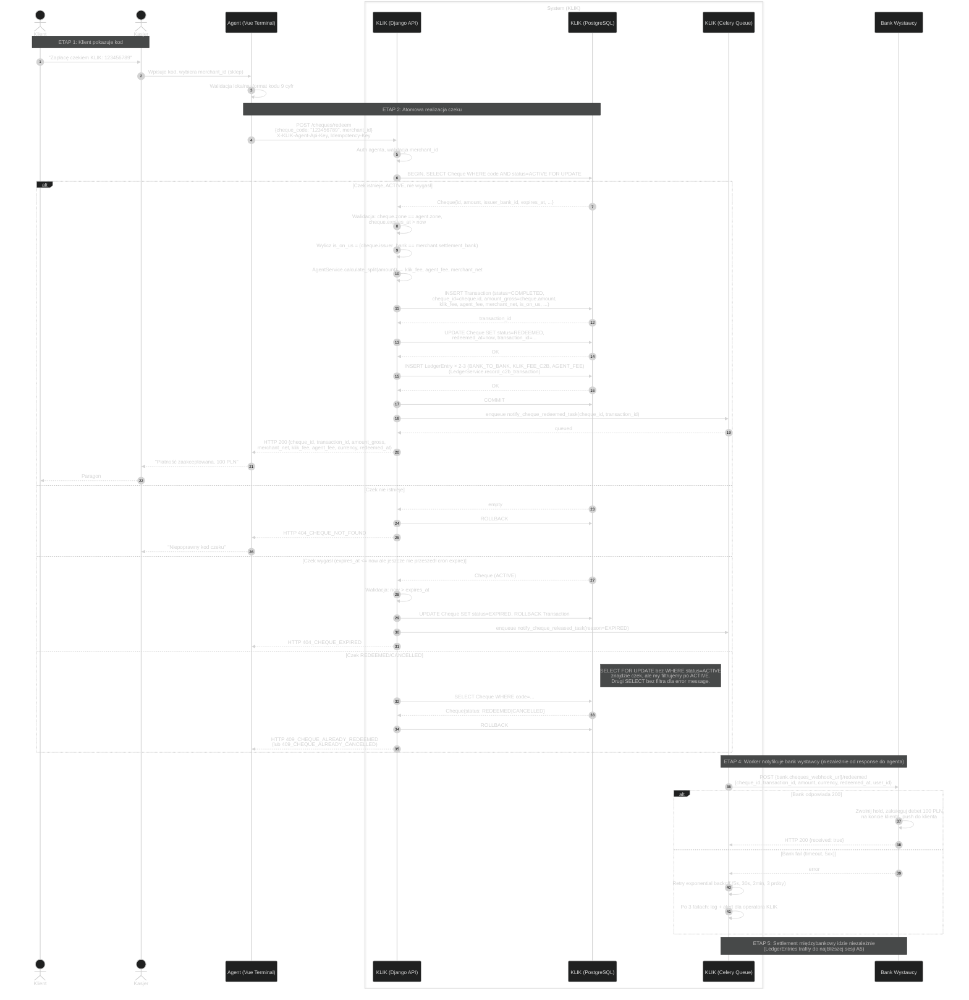
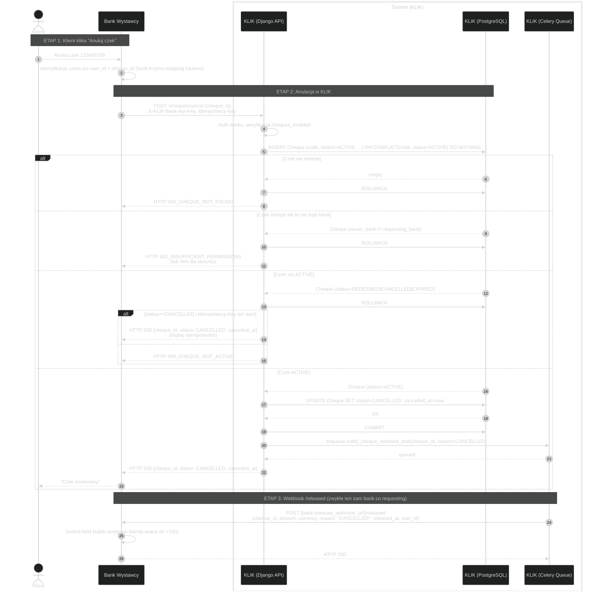
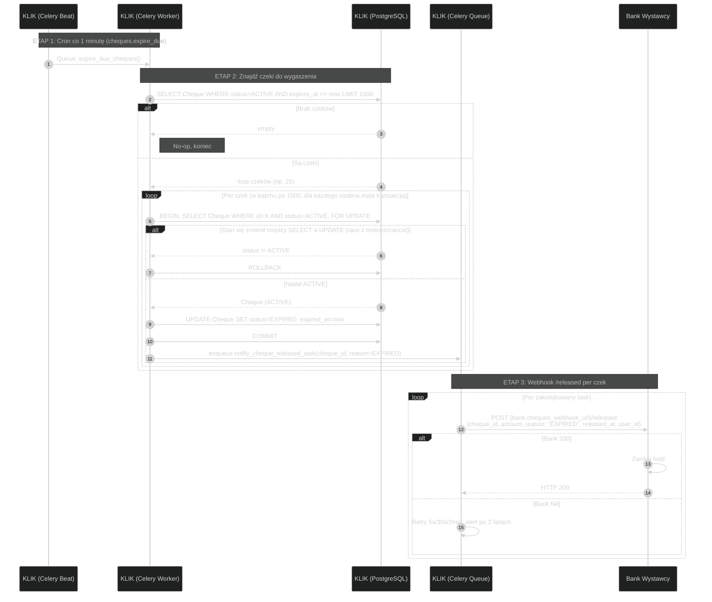

# KLIK Cheques — Diagramy sekwencji

Diagramy sekwencji dla modułu Czeki (Cheques). Format spójny z dokumentacją
C2B (`docs/c2b/diagrams/`) i P2P (`docs/p2p/diagrams/`).

W przeciwieństwie do C2B (gdzie autoryzacja klienta dzieje się **podczas**
płatności) i podobnie do P2P (gdzie KLIK nie uczestniczy w autoryzacji),
w module Czeków **autoryzacja klienta dzieje się przy wystawieniu czeku po
stronie banku**, zanim KLIK zarejestruje czek. KLIK ufa bankowi że hold jest
założony.

---

## Spis treści

### A. Cykl życia czeku
- [CH0 — Wystawienie czeku (issue)](#ch0--wystawienie-czeku-issue)
- [CH1 — Realizacja czeku (redeem)](#ch1--realizacja-czeku-redeem)
- [CH2 — Anulacja czeku (cancel)](#ch2--anulacja-czeku-cancel)
- [CH3 — Wygaśnięcie czeku (expire)](#ch3--wygaśnięcie-czeku-expire)

### B. Settlement
- [CH4 — Settlement realizacji (referencja do A5)](#ch4--settlement-realizacji-referencja-do-a5)

## Powiązana dokumentacja
- [../integration/INFO.md](../integration/INFO.md) — API reference, słownik, model rozliczeniowy
- [../diagrams/STATE.md](./STATE.md) — diagramy stanów + ERD update
- [../../c2b/diagrams/WORKFLOW.md](../../c2b/diagrams/WORKFLOW.md) — sekwencje C2B (analogiczny model)
- [../../c2b/diagrams/WORKFLOW.md#a5--netting--settlement-przez-rtgs](../../c2b/diagrams/WORKFLOW.md#a5--netting--settlement-przez-rtgs) — settlement (wspólny mechanizm)

---

## CH0 — Wystawienie czeku (issue)

Klient w aplikacji bankowej generuje czek. Bank lokalnie blokuje środki,
autoryzuje PIN-em, następnie rejestruje czek w KLIK i pokazuje 9-cyfrowy kod.

**Uwagi:**

- KLIK ufa że bank zablokował środki **przed** wywołaniem `/issue`. Brak tej blokady to bug po stronie banku — KLIK nie ma jak tego wyegzekwować.
- W razie błędu KLIK po stronie banku (np. `400_INVALID_TTL`) bank musi rollbacknąć swój hold. To samo gdy network failure i bank dostanie timeout — bank powinien retryować z tym samym `Idempotency-Key`; jeśli czek został zarejestrowany pomimo timeoutu, retry zwróci tę samą odpowiedź (KLIK nie utworzy duplikatu).

---

## CH1 — Realizacja czeku (redeem)

Klient pokazuje agentowi (sklep/bankomat) 9-cyfrowy kod. Agent wpisuje go
do swojego terminala. KLIK atomowo: zmienia stan czeku, tworzy `Transaction`
ze statusem COMPLETED, generuje ledger entries, kolejkuje webhook do banku
wystawcy.

**Uwagi:**

- Cała sekwencja od `BEGIN` do `COMMIT` jest atomowa — jednocześnie zmiana statusu czeku, INSERT Transaction, INSERT LedgerEntries. Brak ryzyka half-state.
- `SELECT FOR UPDATE` blokuje wiersz Cheque przed równoczesną podwójną realizacją (gdyby dwóch agentów wpisało ten sam kod jednocześnie — drugi czeka, dostaje stan REDEEMED, dostaje 409).
- Webhook do banku wystawcy jest **fire-and-forget** z perspektywy agenta — odpowiedź do agenta NIE czeka na bank. Bank dostanie webhook w ciągu sekund (typowo).
- Jeśli bank wystawcy nie odpowie na 3 retry — czek jest dla KLIK zrealizowany (entries idą do nettingu, sesja zamyka się normalnie), ale klient w aplikacji bankowej może nadal widzieć "czek aktywny". Operator KLIK musi mieć panel do redrive notyfikacji (TBD jako osobne zadanie).

---

## CH2 — Anulacja czeku (cancel)

Klient w aplikacji bankowej kasuje czek. Bank wywołuje KLIK, KLIK zmienia
stan i kolejkuje notyfikację o release.

**Uwagi:**

- W praktyce bank wywołujący `/cancel` jest tym samym bankiem co odbiorca webhooka `/released` — ale rozdzielenie tych dwóch ścieżek jest świadome: cancel jest synchroniczny (klient czeka na potwierdzenie w aplikacji), release jest asynchroniczny i może być retryowany.
- Idempotency: drugi `/cancel` z tym samym `Idempotency-Key` na ten sam czek zwraca to samo bez tworzenia drugiej notyfikacji.

---

## CH3 — Wygaśnięcie czeku (expire)

Cron job KLIK skanuje czeki z `expires_at <= now` i `status=ACTIVE`,
oznacza je jako EXPIRED i kolejkuje webhooki release.

**Uwagi:**

- Cron co minutę = czek wygasa z dokładnością do ~60s. Akceptowalne — dla 24h+ TTL nieistotne.
- Limit `LIMIT 1000` per run zabezpiecza przed eksplozją gdy operator zostawił system bez expire'a przez dłuższy czas. Jeśli >1000 do wygaszenia, kolejny run za minutę zabierze następne.
- Race z `/redeem` i `/cancel`: oba używają `SELECT FOR UPDATE` na tym samym wierszu — wygrywa pierwszy. Worker expire sprawdza ponownie status po lock-u i pomija jeśli się zmienił.

---

## CH4 — Settlement realizacji (referencja do A5)

Settlement międzybankowy realizacji czeku jest **identyczny** jak dla zwykłego C2B:

- LedgerEntries wygenerowane przy `/redeem` (BANK_TO_BANK, KLIK_FEE_C2B, AGENT_FEE) trafiają do następnej sesji rozliczeniowej dla strefy
- Sesja: multilateral netting → SettlementTransfers → RTGS dispatch
- Bank wystawcy debetuje konto klienta lokalnie (po webhooku `/redeemed`), niezależnie od momentu nettingu

Pełny diagram: [C2B WORKFLOW A5](../../c2b/diagrams/WORKFLOW.md#a5--netting--settlement-przez-rtgs).

**Co jest specyficzne dla czeku w settlemencie:** **nic**. Po redempcji czek jest niewidoczny dla mechanizmu settlement — widzi tylko LedgerEntries.

---

## Podsumowanie różnic Cheques vs C2B vs P2P

| Aspekt | C2B (Kody) | P2P (Telefony) | Cheques (Czeki) |
|---|---|---|---|
| **Czas życia obiektu** | 120s w Redis | trwały w Postgres | 1h–72h w Postgres |
| **Format kodu** | 6 cyfr | n/d (telefon E.164) | 9 cyfr |
| **Autoryzacja klienta** | Push do banku, PIN przy płatności | Wewnątrz banku | PIN przy wystawieniu (przed `/issue`) |
| **Webhook autoryzacyjny** | Tak (`/authorize`) | Nie | Nie (autoryzacja przed issue) |
| **Webhook end-of-life** | Nie (status w `/payments/status`) | Nie | Tak (`/redeemed`, `/released`) |
| **Tworzenie Transaction** | `/payments/initiate` (status PENDING) | n/d | `/cheques/redeem` (status COMPLETED od razu) |
| **Hold środków** | Implicit przy `/confirm ACCEPTED` | n/d (KLIK nie uczestniczy) | Explicit przy `/issue`, release przy końcu cyklu |
| **Sesja rozliczeniowa** | Tak | Tak | Tak (wspólna z C2B) |
| **Prowizja KLIK** | % od kwoty | per lookup | % od kwoty (jak C2B) |
| **Cron tasks** | A5 settlement | P4 accrual + A5 settlement | CH3 expire + A5 settlement |
