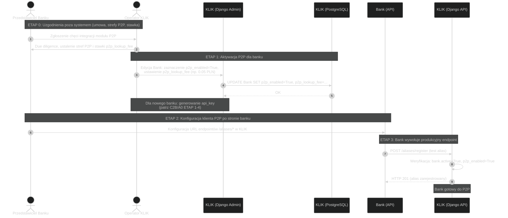
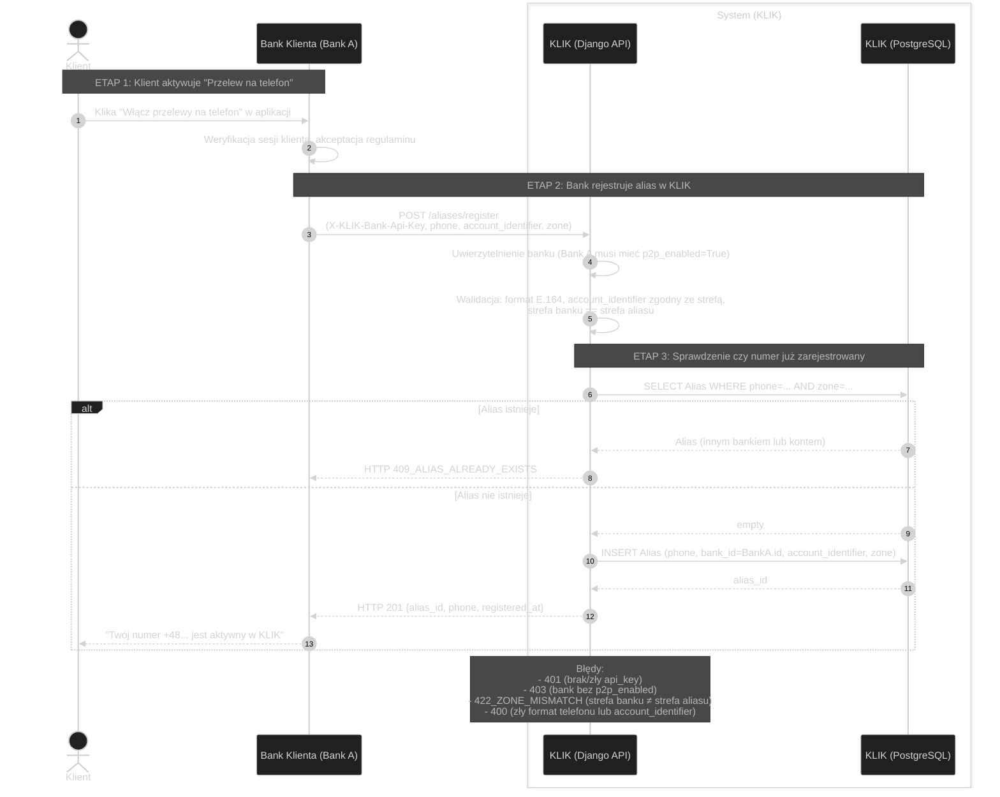
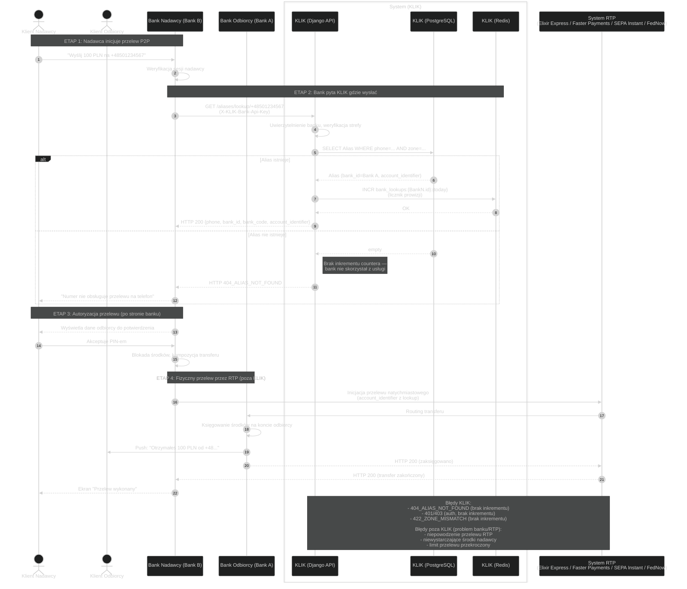
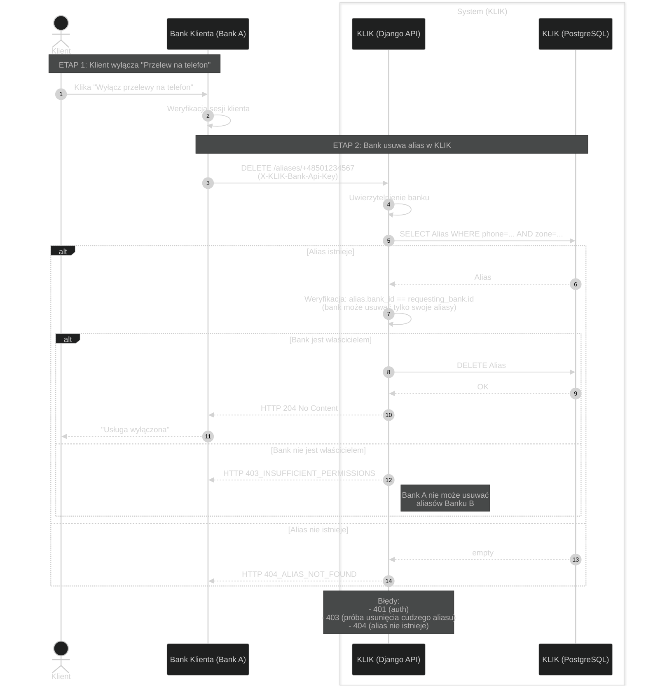
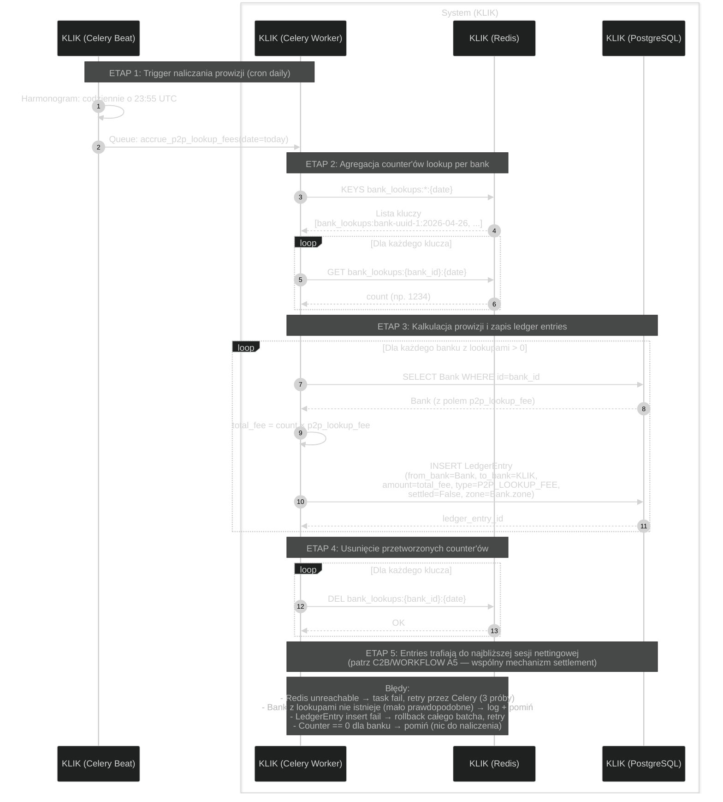
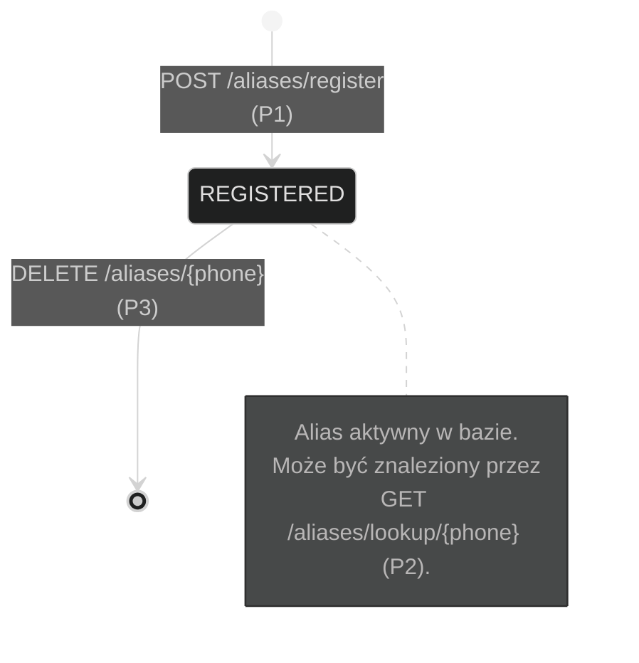

# KLIK — Diagramy P2P (workflow + stany)

Diagramy sekwencji oraz stanów dla modułu Telefony (P2P) systemu KLIK.
Format spójny z dokumentacją C2B (`docs/c2b/diagrams/`).

W przeciwieństwie do C2B, KLIK w P2P pełni rolę **wyłącznie routera aliasów**
— właściwy przepływ pieniędzy dzieje się poza KLIK, przez systemy płatności
natychmiastowych (Elixir Express / Faster Payments / SEPA Instant / FedNow RTP)
realizowane bezpośrednio między bankami.

KLIK pobiera prowizję od banków za **każde wywołanie lookup**
(model lookup-based fee). Stawka per-bank jest negocjowana przy onboardingu
i przechowywana w polu `Bank.p2p_lookup_fee`. Naliczone prowizje agregowane
są nocą i rozliczane przez ten sam mechanizm settlement co C2B (RTGS).

---

## Spis treści

### A. Onboarding
- [P0 — Onboarding banku w P2P](#p0--onboarding-banku-w-p2p)

### B. Cykl życia aliasu
- [P1 — Rejestracja aliasu](#p1--rejestracja-aliasu)
- [P2 — Lookup aliasu (przelew P2P)](#p2--lookup-aliasu-przelew-p2p)
- [P3 — Wyrejestrowanie aliasu](#p3--wyrejestrowanie-aliasu)

### C. Rozliczenia
- [P4 — Naliczanie prowizji (daily fee accrual)](#p4--naliczanie-prowizji-daily-fee-accrual)

### D. Stany
- [Stany Alias](#stany-alias)

## Powiązana dokumentacja
- [../integration/INFO.md](../integration/INFO.md) — API reference, słownik, pricing
- [../bpmn/](../bpmn/) — diagramy BPMN
- [../../c2b/diagrams/WORKFLOW.md](../../c2b/diagrams/WORKFLOW.md) — analogiczne diagramy dla C2B
- [../../c2b/diagrams/STATE.md](../../c2b/diagrams/STATE.md) — pełny ERD systemu
- [../../c2b/diagrams/WORKFLOW.md#a5--netting--settlement-przez-rtgs](../../c2b/diagrams/WORKFLOW.md#a5--netting--settlement-przez-rtgs) — settlement (wspólny dla C2B i P2P)

---

## P0 — Onboarding banku w P2P

Proces aktywacji modułu P2P dla banku. Analogiczny do onboardingu C2B (A0)
z drobnymi różnicami: bank deklaruje udział w module Telefony, dostaje
ustaloną stawkę `p2p_lookup_fee`.

---

## P1 — Rejestracja aliasu

Klient włącza w aplikacji bankowej "Przelew na telefon". Bank rejestruje
mapowanie numer telefonu → konto w KLIK.

**Uwaga:** rejestracja jest **darmowa** — KLIK nie pobiera fee za REGISTER
ani za DELETE, tylko za LOOKUP (P2). Logika: rejestrowanie i wyrejestrowanie
to operacje administracyjne klienta, lookup to operacja przy każdym przelewie.

---

## P2 — Lookup aliasu (przelew P2P)

Bank nadawcy chce wykonać przelew P2P. KLIK pełni rolę "książki telefonicznej"
— zwraca dane routingu i **inkrementuje licznik prowizji** dla banku-pytającego.
**Właściwy przelew odbywa się poza KLIK** przez systemy RTP.

**Prowizja:** każde **udane** wywołanie lookup (zwracające dane routingu)
inkrementuje counter `bank_lookups:{bank_id}:{date}` w Redisie. Lookup
zakończony 404 (alias nie istnieje) **nie nalicza** prowizji — bank nie skorzystał z usługi.

---

## P3 — Wyrejestrowanie aliasu

Klient wyłącza usługę. Bank usuwa alias z KLIK.

---

## P4 — Naliczanie prowizji (daily fee accrual)

Celery Beat task uruchamiany raz dziennie (np. o 23:55) agreguje countery
lookupów per bank, oblicza naliczone prowizje i tworzy `LedgerEntry` dla
każdego banku który wykonywał lookupy. Te entries lecą przez ten sam
mechanizm settlement co C2B fees (patrz [C2B WORKFLOW A5](../../c2b/diagrams/WORKFLOW.md#a5--netting--settlement-przez-rtgs)).

---

## Stany Alias

Cykl życia aliasu w P2P jest minimalny — alias istnieje (jest aktywny)
albo nie istnieje. Brak stanów pośrednich, brak workflow.

**Uwagi:**

1. **Brak soft-delete** w wersji 1.0 — DELETE faktycznie usuwa rekord. Powód:
   GDPR-friendly (nie trzymamy danych dłużej niż trzeba), prostota.
2. **Re-rejestracja** — po DELETE klient może ponownie zarejestrować ten sam
   numer w tym samym lub innym banku. To samo co świeża rejestracja (P1).
3. **Migracja banku** — jeśli klient zmienia bank, najpierw musi DELETE alias
   w starym banku, potem REGISTER w nowym. Brak atomic "transfer aliasu" w v1.0.
4. **Audit log** — fakt rejestracji/wyrejestrowania zostaje w `created_at` /
   logach systemu. Po DELETE rekord znika z głównej tabeli, ale operacja
   jest logowana w audit logu (TBD jako osobne zadanie).

---

## Tabela: różnice P2P vs C2B

Dla porównania ze szczegółową dokumentacją C2B:

| Aspekt | C2B (Kody) | P2P (Telefony) |
|---|---|---|
| **Czas życia obiektu** | Code: 120s w Redisie | Alias: trwały w Postgresie |
| **Stan obiektu** | Code: ACTIVE → USED → expired | Alias: REGISTERED → deleted |
| **Autoryzacja klienta** | Push do banku, PIN | Wewnątrz banku (poza KLIK) |
| **Webhook do banku** | Tak (`/authorize`) | Nie |
| **Celery task (online)** | Tak (autoryzacja async) | Nie (lookupy sync) |
| **Celery task (cron)** | Tak (sesje rozliczeniowe) | Tak (P4 — accrual prowizji) |
| **`/confirm`** | Tak | Nie |
| **Ledger entries (online)** | Tak (przy `/confirm`) | Nie (counter w Redisie) |
| **Ledger entries (cron)** | Nie (online wystarczy) | Tak (P4 — z agregacji counter'ów) |
| **Sesja rozliczeniowa** | Tak (wspólna z P2P) | Tak (wspólna z C2B) |
| **Prowizja KLIK** | % od kwoty (klik_fee) | Per lookup (p2p_lookup_fee × count) |
| **Złożoność modelu** | Transaction + Code + LedgerEntry + ... | Alias + counter w Redis |
