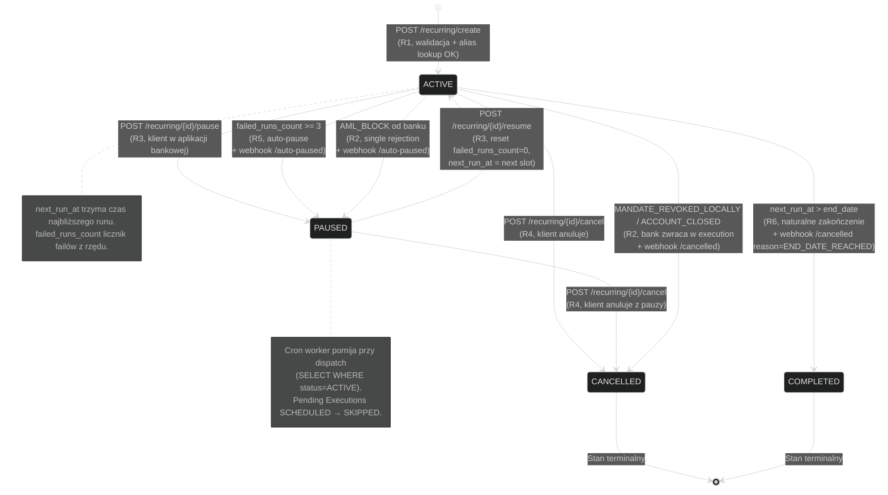
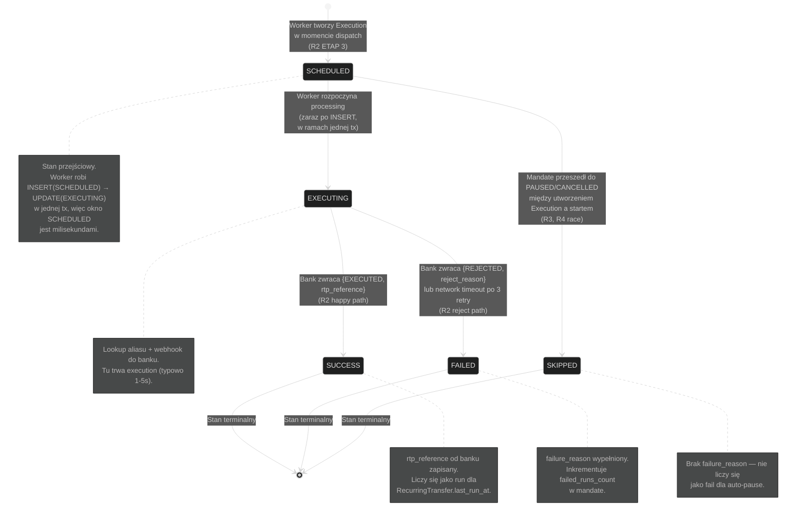
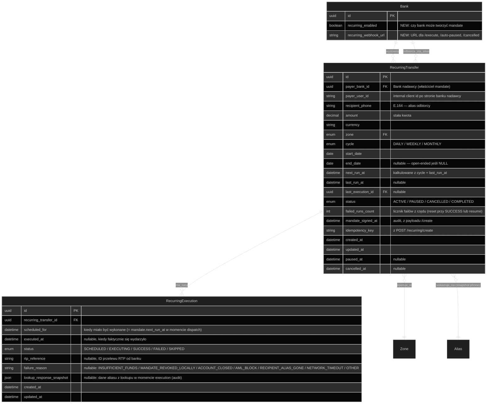

# KLIK Recurring — Diagramy stanów i domeny

Diagramy stanów obiektów Recurring + zaktualizowany ERD systemu z nowymi encjami.

## Spis treści

### Diagramy stanowe (B)
- [B-R1 — Stany RecurringTransfer (Mandate)](#b-r1--stany-recurringtransfer-mandate)
- [B-R2 — Stany RecurringExecution (Run)](#b-r2--stany-recurringexecution-run)

### Diagramy domenowe (C)
- [C-R1 — ERD update (Recurring w modelu)](#c-r1--erd-update-recurring-w-modelu)

### Dokumenty referencyjne
- [Uwagi do modelu](#uwagi-do-modelu)
- [Wpływ na istniejące encje](#wpływ-na-istniejące-encje)

## Powiązana dokumentacja
- [WORKFLOW.md](./WORKFLOW.md) — diagramy sekwencji (R0-R6)
- [../integration/INFO.md](../integration/INFO.md) — API reference
- [../../c2b/diagrams/STATE.md](../../c2b/diagrams/STATE.md) — pełny ERD systemu

---

## B-R1 — Stany RecurringTransfer (Mandate)

Mandate żyje od momentu utworzenia do CANCELLED (manualnie) lub COMPLETED
(automatycznie po `end_date`).

**Uwagi do maszyny stanów RecurringTransfer:**

- Brak `PAUSED → COMPLETED` — żeby skończyć naturalnie mandate musi być najpierw resume'owany. Jeśli klient zostawił PAUSED i `end_date` minął, mandate zostaje w PAUSED — operator musi to obsłużyć ręcznie (TBD: ewentualny cron auto-cleanup po N dni w PAUSED, post-MVP).

- `ACTIVE → CANCELLED` jest jedyną drogą do CANCELLED (z PAUSED też, ale przez ten sam endpoint). Brak ścieżki "mandate sam się skasował".

- `failed_runs_count` jest **resetowany** w trzech sytuacjach: SUCCESS execution, resume, lub manualny edit operatora.

---

## B-R2 — Stany RecurringExecution (Run)

Pojedyncza execution ma krótkie życie — od momentu utworzenia (kiedy worker
podejmuje mandate) do terminala (success/failed/skipped). Zwykle <30s całość.

**Uwagi:**

- Stan `SCHEDULED` istnieje krótko bo worker tworzy execution i od razu robi UPDATE na EXECUTING. Po awarii workera (kill -9 między INSERT i UPDATE) execution zostaje w SCHEDULED — operator musi to zauważyć (TBD: cron sprzątający stale SCHEDULED po 5 min na status=FAILED z reason=ORPHANED).

- `SCHEDULED → SKIPPED` to scenariusz race: worker A tworzy execution, w międzyczasie request `/pause` zmienia mandate na PAUSED, worker B (lub ten sam) widzi PAUSED i zamiast EXECUTING ustawia SKIPPED. To rzadkie ale możliwe.

- Brak stanu RETRYING — retry jest implementacyjnie wewnątrz EXECUTING (3 próby network), nie jako osobny stan w DB.

---

## C-R1 — ERD update (Recurring w modelu)

---

## Uwagi do modelu

### 1. Indeksy

Krytyczne dla wydajności:

| Indeks | Pole(a) | Powód |
|---|---|---|
| `recurring_transfer_dispatch_idx` | `(status, next_run_at)` partial WHERE status='ACTIVE' | Cron query co 5 min — najczęstszy access pattern |
| `recurring_transfer_payer_idx` | `(payer_bank_id, payer_user_id, status)` | Listing mandate-ów klienta (`GET /recurring?payer_user_id=`) |
| `recurring_transfer_idempotency_idx` | `(idempotency_key, payer_bank_id)` UNIQUE | Idempotency lookup dla `/create` |
| `recurring_execution_mandate_idx` | `(recurring_transfer_id, scheduled_for DESC)` | Listing executions (`GET /recurring/{id}/executions`) |
| `recurring_execution_status_idx` | `(status)` partial WHERE status='SCHEDULED' | Cleanup orphaned executions |

### 2. Relacja do Alias

Świadomie **nie ma FK** z `RecurringTransfer.recipient_phone` do `Alias.phone`:

- Alias może zostać DELETE'owany niezależnie od mandate-ów (klient odbiorcy zmienia bank, wyłącza P2P)
- FK constraint blokowałby delete aliasu który ma aktywne mandate-y kierowane na niego — to nie nasza sprawa egzekwować przy delete (bank odbiorcy nie wie o mandate w innych bankach)
- Zamiast tego: `RecurringExecution.lookup_response_snapshot` zachowuje co znaleźliśmy w czasie execution, plus `failure_reason='RECIPIENT_ALIAS_GONE'` jeśli zniknął

### 3. cycle jako enum vs cron expression

W MVP enum (`DAILY/WEEKLY/MONTHLY`) bo:
- Łatwiej walidować
- Łatwiej wyświetlać w aplikacji bankowej ("co miesiąc" vs "0 8 1 * *")
- Pokrywa 95% use case'ów

Post-MVP można dodać `cycle_expression` (cron string) jako alternatywne pole z osobną logiką kalkulacji `next_run_at`.

### 4. Czas w UTC

Wszystkie pola datetime trzymane w UTC (Postgres `TIMESTAMPTZ`). Konwersja na czas
lokalny strefy klienta robiona w aplikacji bankowej, nie w KLIK.

### 5. Delete vs soft-delete

Brak soft-delete dla mandate-ów. Stany terminalne (CANCELLED/COMPLETED)
zostają w bazie permanentnie dla audytu. Polityka retencji TBD.

---

## Wpływ na istniejące encje

### Bank (modyfikacja)

Dodajemy 2 pola:

| Pole | Typ | Default | Opis |
|---|---|---|---|
| `recurring_enabled` | bool | `False` | Bank uczestniczy w module Recurring. Wymaga też `p2p_enabled=True`. |
| `recurring_webhook_url` | URL | `''` | URL dla webhooków `/execute`, `/auto-paused`, `/cancelled`. Pusty = fallback do `Bank.webhook_url`. |

Migracja: dodanie pól bez wpływu na istniejące rekordy.

### Brak zmian w innych encjach

`Agent`, `MSCAgreement`, `Merchant`, `Transaction`, `LedgerEntry`,
`SettlementSession`, `SettlementTransfer`, `Alias`, `Cheque` — bez zmian.

Recurring **nie tworzy** żadnych C2B LedgerEntries (transfer pieniędzy odbywa
się przez RTP poza KLIK). Naliczanie prowizji P2P przy execution korzysta
z istniejącego mechanizmu (counter w Redis + P4 daily accrual).

---

## Tabela porównawcza encji per moduł (zaktualizowana)

| Encja | C2B | P2P | Cheques | Recurring |
|---|---|---|---|---|
| **Centralny obiekt** | Code (Redis) | Alias (Postgres) | Cheque (Postgres) | RecurringTransfer (Postgres) |
| **Sub-encja** | Transaction | brak (counter w Redis) | brak (Transaction reused) | RecurringExecution |
| **TTL/lifetime** | 120s | trwały | 1h–72h | do `end_date` (mogą być lata) |
| **Tworzy Transaction** | tak | nie | tak (z `cheque_id`) | nie (przelew RTP poza KLIK) |
| **Tworzy LedgerEntries** | przy /confirm | przy P4 accrual | przy /redeem | przy P4 accrual (lookup fees) |
| **Webhooki banku (KLIK→Bank)** | `/authorize` | brak | `/redeemed`, `/released` | `/execute`, `/auto-paused`, `/cancelled` |
| **Cron tasks** | A5 settlement | P4 accrual | CH3 expire | R-dispatch (co 5min), A5/P4 (wspólne) |
| **Kto trigger-uje?** | Agent (płatność) / Bank (issue) | Bank (lookup) | Bank (issue), Agent (redeem) | **KLIK** (cron) |
