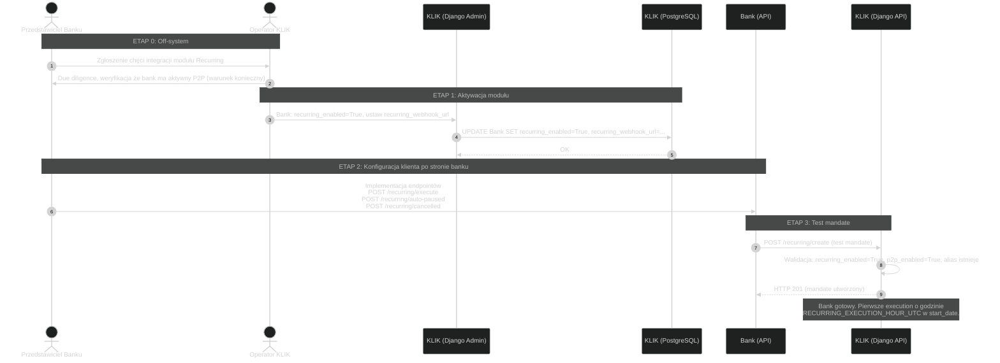
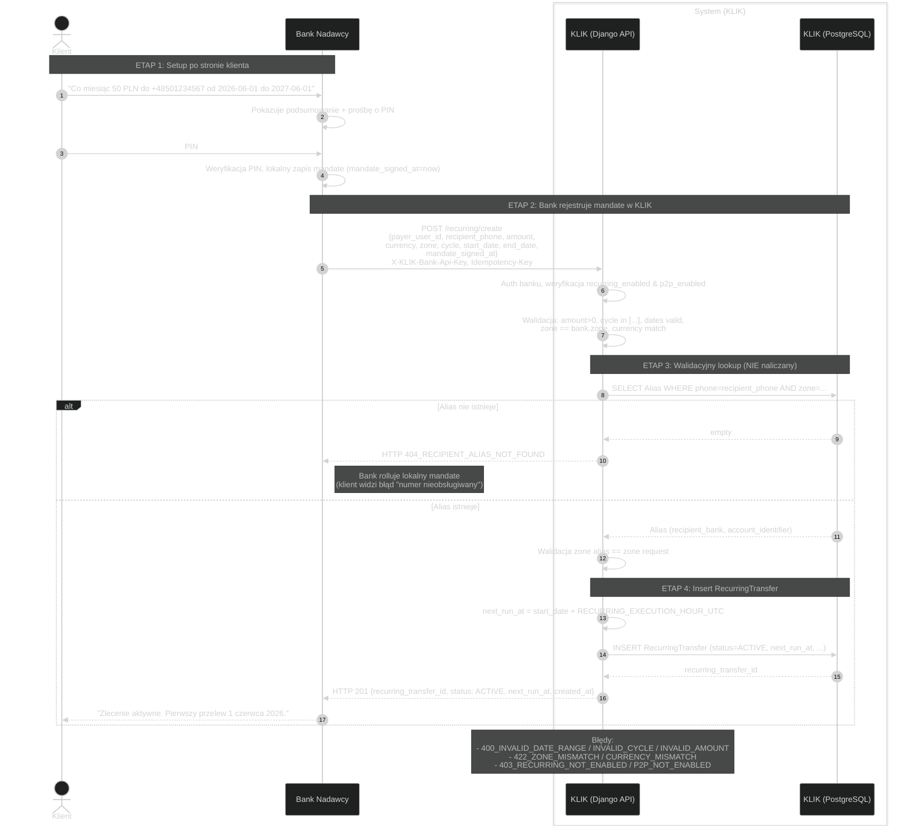
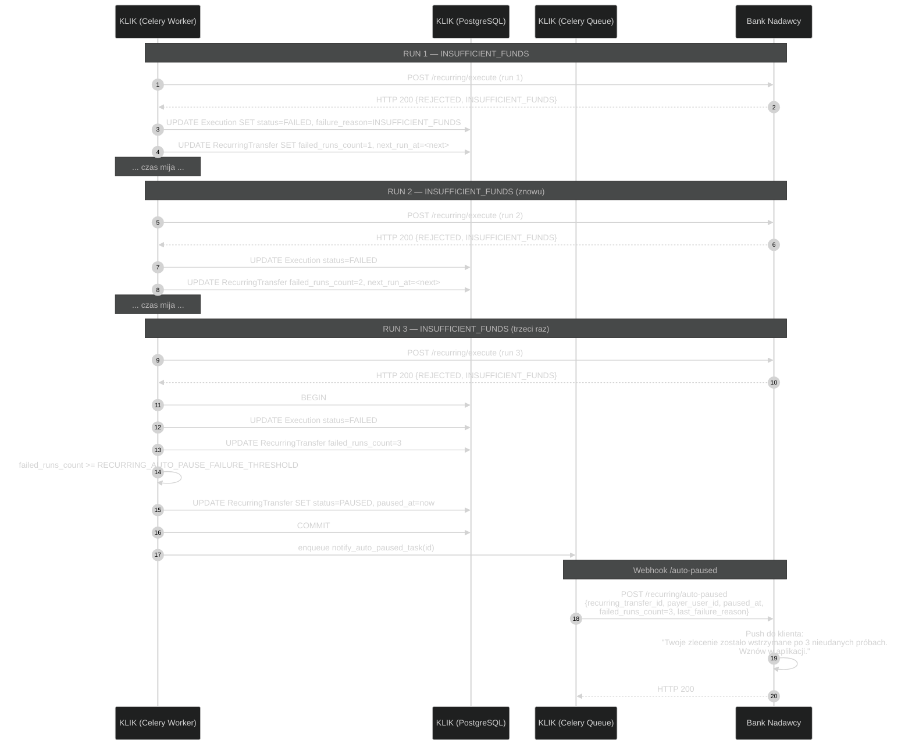
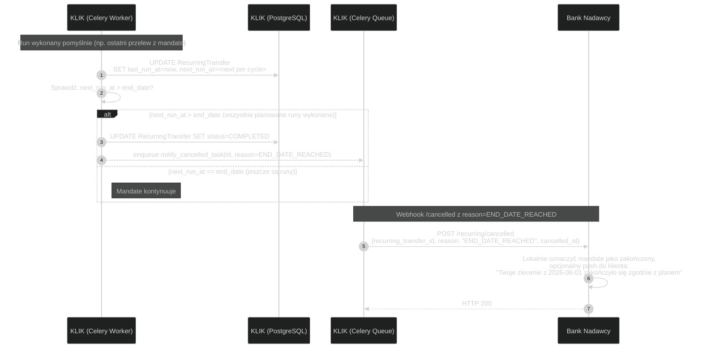

# KLIK Recurring — Diagramy sekwencji

Diagramy sekwencji dla modułu Regularne transfery (Recurring). Format spójny
z C2B/P2P/Cheques.

W przeciwieństwie do C2B i Cheques, recurring jest **długo żyjący** — od
momentu utworzenia mandate do `end_date` lub anulacji. Każde wykonanie
(execution) to osobny event przez webhook do banku, który sam wykonuje
przelew RTP poza KLIK (jak w P2P).

---

## Spis treści

### A. Onboarding
- [R0 — Onboarding banku w Recurring](#r0--onboarding-banku-w-recurring)

### B. Cykl życia mandate
- [R1 — Utworzenie mandate (create)](#r1--utworzenie-mandate-create)
- [R2 — Wykonanie pojedynczego runu (execution)](#r2--wykonanie-pojedynczego-runu-execution)
- [R3 — Pause i Resume](#r3--pause-i-resume)
- [R4 — Cancel](#r4--cancel)

### C. Mechanizmy automatyczne
- [R5 — Auto-pause po 3 failach](#r5--auto-pause-po-3-failach)
- [R6 — Naturalne zakończenie (end_date)](#r6--naturalne-zakończenie-end_date)

### D. Settlement
- [Settlement (referencja do P2P/A5)](#settlement-referencja-do-p2pa5)

## Powiązana dokumentacja
- [../integration/INFO.md](../integration/INFO.md) — API reference, słownik, model
- [../diagrams/STATE.md](./STATE.md) — diagramy stanów + ERD update
- [../../p2p/diagrams/WORKFLOW.md](../../p2p/diagrams/WORKFLOW.md) — sekwencje P2P (lookup, fee accrual)

---

## R0 — Onboarding banku w Recurring



---

## R1 — Utworzenie mandate (create)

Klient w aplikacji bankowej zleca "co miesiąc 50 PLN do +48...". Bank zbiera
PIN, rejestruje mandate u siebie, wywołuje KLIK.



**Uwagi:**

- Walidacyjny lookup w ETAP 3 jest **darmowy** dla banku (nie inkrementujemy P2P countera). Płatne są dopiero lookupy w runach (R2).
- Bank ufa że KLIK go zwoła w czasie. Klient po PIN-ie nie widzi nic do `start_date` (poza wpisem "aktywne zlecenie" w aplikacji).

---

## R2 — Wykonanie pojedynczego runu (execution)

Cron Beat co 5 minut sprawdza mandate-y do wykonania. Worker robi lookup,
woła bank webhookiem, zapisuje wynik.

```mermaid
---
config:
  theme: dark
---
sequenceDiagram
    autonumber
    participant Beat as KLIK (Celery Beat)
    participant Worker as KLIK (Celery Worker)
    box System (KLIK)
        participant API as KLIK (Django API/internal)
        participant DB as KLIK (PostgreSQL)
        participant Redis as KLIK (Redis)
    end
    participant BankN as Bank Nadawcy
    participant RTP as System RTP

    %% ETAP 1: Trigger (co RECURRING_DISPATCH_INTERVAL_SECONDS)
    Note over Beat, Worker: ETAP 1: Co 5 min — dispatch due mandate-ów
    Beat->>Worker: Queue: dispatch_due_recurring_transfers()

    %% ETAP 2: Selekcja mandate-ów
    Note over Worker, DB: ETAP 2: Pobierz due mandate-y
    Worker->>DB: SELECT RecurringTransfer<br/>WHERE status=ACTIVE AND next_run_at <= now<br/>FOR UPDATE SKIP LOCKED LIMIT 1000
    alt Brak mandate-ów
        DB-->>Worker: empty
        Note right of Worker: No-op
    else Są mandate-y
        DB-->>Worker: lista (np. 30)

        loop Per mandate (każdy w osobnym subtaskcie)
            Worker->>Worker: enqueue execute_recurring_run(mandate_id)
        end
    end

    %% ETAP 3: Pojedynczy run (osobny task)
    Note over Worker, BankN: ETAP 3: Pojedyncze execution (jeden mandate)
    Note over Worker: execute_recurring_run(mandate_id)
    Worker->>DB: BEGIN; SELECT RecurringTransfer FOR UPDATE
    alt Mandate nie ACTIVE (race z pause/cancel)
        DB-->>Worker: status != ACTIVE
        Worker->>DB: ROLLBACK
        Note right of Worker: Skip — pause/cancel wygrał
    else Mandate ACTIVE
        DB-->>Worker: RecurringTransfer
        Worker->>DB: INSERT RecurringExecution<br/>(status=SCHEDULED, scheduled_for=mandate.next_run_at)
        DB-->>Worker: execution_id
        Worker->>DB: UPDATE RecurringExecution SET status=EXECUTING
        Worker->>DB: COMMIT

        %% ETAP 4: Lookup aliasu (PŁATNY)
        Note over Worker, Redis: ETAP 4: Lookup aliasu (counter +1)
        Worker->>DB: SELECT Alias WHERE phone=mandate.recipient_phone
        alt Alias zniknął
            DB-->>Worker: empty
            Worker->>DB: UPDATE RecurringExecution SET status=FAILED, failure_reason='RECIPIENT_ALIAS_GONE'
            Worker->>DB: UPDATE RecurringTransfer SET failed_runs_count++, next_run_at=<next>
            Note right of Worker: Counter NIE inkrementowany<br/>(lookup nie znalazł = 404)
        else Alias istnieje
            DB-->>Worker: Alias
            Worker->>Redis: INCR aliases:lookups:{mandate.payer_bank_id}:{date}
            Redis-->>Worker: OK

            %% ETAP 5: Webhook do banku nadawcy
            Note over Worker, BankN: ETAP 5: Webhook /execute (synchroniczny, 30s timeout)
            Worker->>BankN: POST {bank.recurring_webhook_url}/execute<br/>{recurring_transfer_id, execution_id, payer_user_id,<br/>amount, currency, scheduled_for, mandate_signed_at,<br/>recipient: {phone, bank_id, bank_code, account_identifier}}

            alt Bank odpowiada EXECUTED
                BankN->>BankN: Lokalna walidacja: mandate aktywny lokalnie?<br/>klient ma środki?
                BankN->>RTP: Inicjacja przelewu RTP (account_identifier, amount)
                RTP-->>BankN: HTTP 200 (rtp_reference)
                BankN-->>Worker: HTTP 200 {status: "EXECUTED", rtp_reference, executed_at}

                Worker->>DB: BEGIN; UPDATE RecurringExecution<br/>SET status=SUCCESS, executed_at=..., rtp_reference=...
                Worker->>DB: UPDATE RecurringTransfer<br/>SET last_run_at=now, last_execution_id=...,<br/>failed_runs_count=0,<br/>next_run_at=<next per cycle>
                Worker->>DB: Sprawdź: czy next_run_at > end_date?
                alt next_run_at > end_date
                    Worker->>DB: UPDATE RecurringTransfer SET status=COMPLETED
                    Worker->>Worker: enqueue notify_cancelled(reason=END_DATE_REACHED)
                end
                Worker->>DB: COMMIT

            else Bank odpowiada REJECTED
                BankN-->>Worker: HTTP 200 {status: "REJECTED", reject_reason: "INSUFFICIENT_FUNDS"}
                Worker->>DB: BEGIN; UPDATE RecurringExecution<br/>SET status=FAILED, failure_reason=reject_reason
                Worker->>DB: UPDATE RecurringTransfer<br/>SET failed_runs_count++, next_run_at=<next per cycle>

                alt reject_reason in [MANDATE_REVOKED_LOCALLY, ACCOUNT_CLOSED]
                    Worker->>DB: UPDATE RecurringTransfer SET status=CANCELLED
                    Worker->>Worker: enqueue notify_cancelled(reason)
                else reject_reason == AML_BLOCK
                    Worker->>DB: UPDATE RecurringTransfer SET status=PAUSED
                    Worker->>Worker: enqueue notify_auto_paused(reason=AML_BLOCK)
                else failed_runs_count >= AUTO_PAUSE_THRESHOLD
                    Worker->>DB: UPDATE RecurringTransfer SET status=PAUSED
                    Worker->>Worker: enqueue notify_auto_paused
                end
                Worker->>DB: COMMIT

            else Network failure / timeout
                Note right of Worker: Retry 5s, 30s, 2min — patrz R5
                Worker->>Worker: Schedule retry
            end
        end
    end
```

**Uwagi:**

- `FOR UPDATE SKIP LOCKED` w ETAP 2 pozwala uruchomić wielu workerów równolegle na tym samym Beat tick — każdy bierze inną porcję mandate-ów bez zakleszczenia.
- Inkrement countera dzieje się **przed** webhookiem do banku. Jeśli bank potem zwróci REJECTED, counter zostaje zinkrementowany — bank skorzystał z lookupu, że płatność nie wyszła to jego problem.
- `next_run_at` jest aktualizowane **niezależnie od wyniku** (success/fail) — fail nie zatrzymuje cyklu, chyba że threshold pauzy przekroczony.

---

## R3 — Pause i Resume

Klient w aplikacji bankowej wstrzymuje zlecenie i potem wznawia.

```mermaid
---
config:
  theme: dark
---
sequenceDiagram
    autonumber
    actor Klient
    participant BankN as Bank Nadawcy
    box System (KLIK)
        participant API as KLIK (Django API)
        participant DB as KLIK (PostgreSQL)
    end

    %% PAUSE
    Note over Klient, BankN: PAUSE
    Klient->>BankN: "Wstrzymaj zlecenie"
    BankN->>API: POST /recurring/{id}/pause<br/>X-KLIK-Bank-Api-Key, Idempotency-Key
    API->>DB: BEGIN; SELECT RecurringTransfer FOR UPDATE
    alt Mandate nie ACTIVE
        API->>DB: ROLLBACK
        API-->>BankN: HTTP 409_RECURRING_NOT_ACTIVE
    else ACTIVE i to bank wystawcy
        API->>DB: UPDATE RecurringTransfer SET status=PAUSED, paused_at=now
        API->>DB: COMMIT
        API-->>BankN: HTTP 200 {status: PAUSED, paused_at}
        BankN-->>Klient: "Zlecenie wstrzymane"
    end

    Note over API: Pending RecurringExecutions w stanie SCHEDULED dla tego mandate-a<br/>worker pominie przy następnej dispatch (sprawdza status mandate przed execute)

    %% RESUME (po jakimś czasie)
    Note over Klient, BankN: RESUME (np. po miesiącu)
    Klient->>BankN: "Wznów zlecenie"
    BankN->>API: POST /recurring/{id}/resume
    API->>DB: BEGIN; SELECT RecurringTransfer FOR UPDATE
    alt Mandate nie PAUSED
        API->>DB: ROLLBACK
        API-->>BankN: HTTP 409_RECURRING_NOT_PAUSED
    else PAUSED
        API->>API: next_run_at = compute_next_slot(now, cycle, start_date)<br/>(NIE catch-up)
        API->>DB: UPDATE RecurringTransfer<br/>SET status=ACTIVE, next_run_at=..., failed_runs_count=0
        API->>DB: COMMIT
        API-->>BankN: HTTP 200 {status: ACTIVE, next_run_at, resumed_at}
        BankN-->>Klient: "Zlecenie aktywne, najbliższy przelew: <data>"
    end
```

**Uwagi:**

- Resume **nie nadrabia** missed runów. `next_run_at` po resume to najbliższy przyszły slot zgodnie z cyklem.
- Resume resetuje `failed_runs_count` — fresh start.

---

## R4 — Cancel

Klient kasuje zlecenie na stałe (lub bank wymusza cancel z powodu np. zamknięcia konta — przez `MANDATE_REVOKED_LOCALLY` w execution → automatyczny path).

```mermaid
---
config:
  theme: dark
---
sequenceDiagram
    autonumber
    actor Klient
    participant BankN as Bank Nadawcy
    box System (KLIK)
        participant API as KLIK (Django API)
        participant DB as KLIK (PostgreSQL)
        participant Q as KLIK (Celery Queue)
    end

    Klient->>BankN: "Anuluj zlecenie"
    BankN->>BankN: Lokalny remove mandate
    BankN->>API: POST /recurring/{id}/cancel<br/>X-KLIK-Bank-Api-Key, Idempotency-Key
    API->>DB: BEGIN; SELECT RecurringTransfer FOR UPDATE

    alt Mandate w stanie terminalnym
        API->>DB: ROLLBACK
        API-->>BankN: HTTP 409_RECURRING_TERMINATED
    else Mandate ACTIVE lub PAUSED, request od bank wystawcy
        API->>DB: UPDATE RecurringTransfer SET status=CANCELLED, cancelled_at=now
        API->>DB: COMMIT
        API->>Q: enqueue notify_cancelled_task(id, reason="USER_REQUEST")
        API-->>BankN: HTTP 200 {status: CANCELLED, cancelled_at}
        BankN-->>Klient: "Zlecenie anulowane"
    end

    Note over Q, BankN: Webhook /cancelled (idempotentne — bank już wie, ale standard)
    Q->>BankN: POST /recurring/cancelled<br/>{recurring_transfer_id, reason: "USER_REQUEST", cancelled_at}
    BankN-->>Q: HTTP 200
```

**Uwagi:**

- Webhook `/cancelled` jest tu częściowo redundantny (bank sam zaintencjonował cancel), ale wysyłamy **zawsze** dla spójności — bank ma jeden punkt obsługi "co robić gdy mandate zostaje wycofany". Bank może to traktować jako no-op idempotency.

---

## R5 — Auto-pause po 3 failach

Pokazuje pełną sekwencję trzech failed executions prowadzącą do auto-pause.



**Uwagi:**

- Threshold konfigurowalny przez `RECURRING_AUTO_PAUSE_FAILURE_THRESHOLD` (default 3).
- Klient może wykonać resume przez `POST /recurring/{id}/resume` — counter się resetuje, threshold liczony od nowa.

---

## R6 — Naturalne zakończenie (end_date)

Mandate dochodzi do daty końcowej. Następne execution nie ma sensu — KLIK
przechodzi mandate do `COMPLETED` i notyfikuje bank.



**Uwagi:**

- Used the same webhook (`/cancelled`) z różnym `reason`, żeby bank miał jeden punkt obsługi end-of-life. Alternatywnie można zrobić osobny `/completed` — TBD jeśli banki będą tego potrzebować.

---

## Settlement (referencja do P2P/A5)

Recurring sam w sobie **nie generuje** standardowych C2B LedgerEntries (nie ma transferu pieniędzy przez KLIK — leci RTP poza KLIK).

To co generuje:
- **P2P_LOOKUP_FEE entries** — przy daily accrual P4 (cron 23:55 UTC), z agregacji counter-ów `aliases:lookups:*` w Redisie. Recurring lookupy dorzucają się do tych counterów tak samo jak ad-hoc P2P lookupy.

Czyli z perspektywy ledgera **recurring jest niewidzialny** poza tym że bank nadawcy ma zwiększoną liczbę lookupów. Settlement: standardowy mechanizm sesji nettingowych ([C2B WORKFLOW A5](../../c2b/diagrams/WORKFLOW.md#a5--netting--settlement-przez-rtgs)).

---

## Podsumowanie różnic Recurring vs reszta

| Aspekt | C2B | P2P | Cheques | Recurring |
|---|---|---|---|---|
| **Główny obiekt** | Code | Alias | Cheque | RecurringTransfer + Execution |
| **Życie obiektu** | 120s | trwałe | 1h–72h | tygodnie/miesiące/lata |
| **Trigger transferu** | Klient + agent | Klient w banku | Klient + agent (redeem) | KLIK Cron Beat |
| **Autoryzacja klienta** | Per płatność (PIN) | Wewnątrz banku | Raz przy issue | Raz przy create (mandate) |
| **Webhook do banku** | `/authorize` per tx | brak | `/redeemed`, `/released` end-of-life | `/execute` per run, `/auto-paused`, `/cancelled` |
| **KLIK trigger-uje czas** | Nie | Nie | Nie (cron tylko expire) | **Tak** (główny mechanizm) |
| **Pieniądze przez KLIK** | Nie (RTGS netting) | Nie (RTP poza KLIK) | Nie (RTGS netting po redeem) | Nie (RTP poza KLIK) |
| **Prowizja KLIK** | % od kwoty | per lookup | % od kwoty (jak C2B) | per lookup (jak P2P) |
